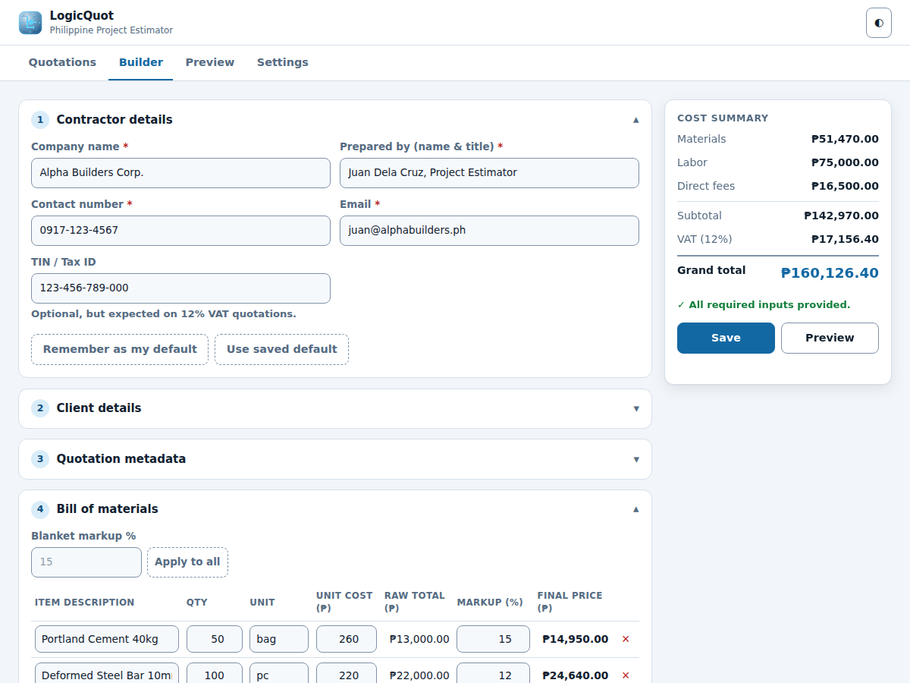
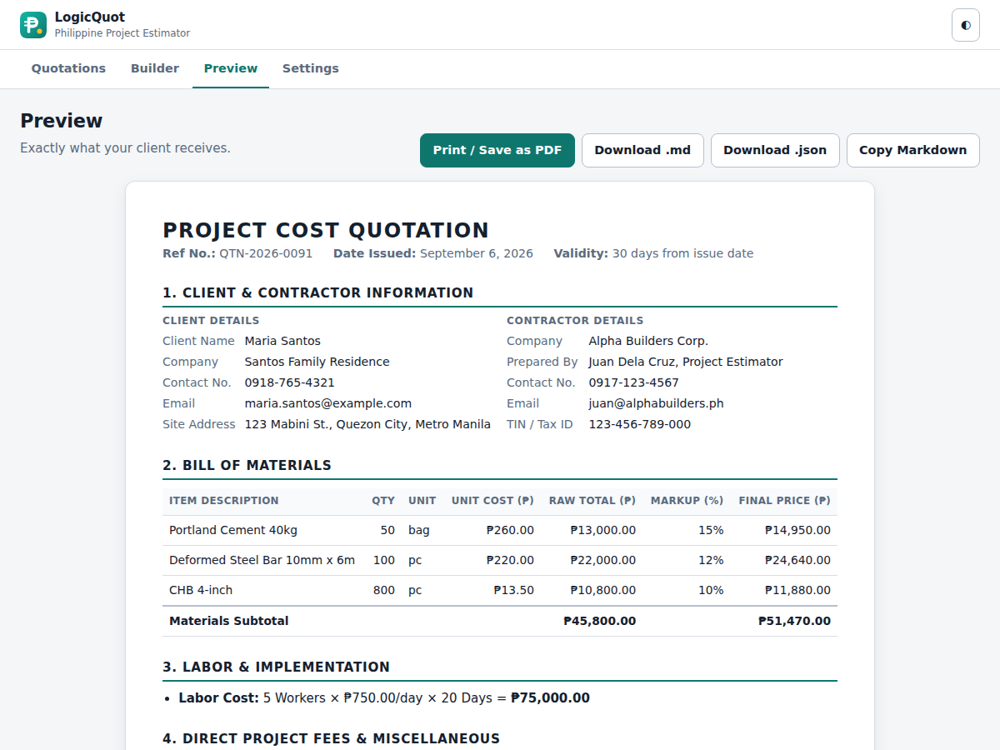

# LogicQuot

An offline-first Progressive Web App for building itemized **Philippine Peso (₱)
project cost quotations**. It is a port of the `ph-quotation-generator` Claude
Code project: the same calculation rules, the same required-input checklist and
the same output layout, turned into an installable app you can use on a phone at
a job site with no signal.

| Builder | Preview |
| --- | --- |
|  |  |

## What it does

- **Itemized bill of materials** — per-line quantity, unit, unit cost and markup,
  with the raw total and the marked-up final price shown side by side so a client
  can verify every peso.
- **Labor** — workers × daily rate × days, or a flat fee.
- **Direct project fees** — mobilization/delivery, permits, equipment rental, plus
  any number of extra itemized fees.
- **VAT** — Non-VAT or 12% VAT, applied to the subtotal.
- **Live totals** — every figure recalculates as you type.
- **Completeness check** — tells you what is still missing before you send, and
  never invents a TIN, reference number or contact detail.
- **Exports** — print / save as PDF, download Markdown in the original template
  layout, or download JSON in the same schema as `examples/sample_input.json`.
- **Works offline** — the whole app is cached by a service worker, and every
  quotation is stored locally in your browser. There is no backend and nothing is
  uploaded anywhere.

## Running it

There is no build step and nothing to install — you only need Node.

```bash
git clone https://github.com/jcem0615-rgb/Automated-Computation.git
cd Automated-Computation
git checkout claude/logicquot-pwa-app-ma2mb2
npm start
```

Then open **http://localhost:8080**. To use a different port:

```bash
npm start -- 8081
```

Any other static server works just as well:

```bash
python3 -m http.server 8080
npx http-server . -p 8080 -c-1
```

Once it is open, use **Install** (Chrome/Edge, in the address bar) or
**Share → Add to Home Screen** (iOS Safari) to install it as an app.

> A service worker requires `https://` or `localhost`. Opening `index.html`
> directly from the filesystem will not register one, and ES modules will be
> blocked by CORS — always serve it over HTTP.

### Deploying

It is a plain static site: push the repository root to GitHub Pages, Netlify,
Vercel, or any static host. All paths are relative, so it works from a
subdirectory too.

## Using it

1. **Quotations** — your saved quotations. *New quotation* starts a blank one;
   *Load sample* fills in the example project so you can see the whole flow.
2. **Builder** — seven collapsible sections following the input checklist. The
   running cost summary is a sticky rail on desktop and a fixed bottom bar on
   mobile.
3. **Preview** — the finished client-facing document, plus the export buttons.
4. **Settings** — import JSON, back everything up, and read the calculation rules.

Handy details:

- **Remember as my default** stores your contractor block so every new quotation
  starts pre-filled.
- **Blanket markup** applies one percentage to every line item at once.
- **Suggest** generates the next `QTN-<year>-<n>` reference number.

## Calculation rules

Implemented verbatim from [`docs/calculation_rules.md`](docs/calculation_rules.md),
in `js/calc.js`:

```
Raw Total        = Quantity × Unit Cost
Final Price      = Raw Total × (1 + Markup % / 100)
Total Materials  = Σ Final Price
Total Labor      = Workers × Daily Rate × Days   (or the Flat Fee)
Total Direct Fees= Mobilization + Permits + Equipment + other fees
Subtotal         = Total Materials + Total Labor + Total Direct Fees
VAT              = Subtotal × 0.12               (only when VAT status is 12% VAT)
Grand Total      = Subtotal + VAT
```

Nothing is rounded until it is displayed; currency renders as `₱1,234.50`.

## Project layout

```
├── index.html                    # App shell: all four views
├── manifest.webmanifest          # PWA manifest
├── sw.js                         # Service worker (offline cache)
├── css/styles.css                # Styling, incl. dark mode and print
├── js/
│   ├── app.js                    # Router, form binding, exports, install prompt
│   ├── calc.js                   # Calculation rules (pure)
│   ├── format.js                 # ₱ / % / date formatting
│   ├── markdown.js               # Renders templates/quotation_template.md
│   ├── model.js                  # Quotation shape + normalisation
│   ├── preview.js                # Client-facing HTML rendering
│   ├── storage.js                # localStorage persistence
│   └── validate.js               # Required-inputs completeness check
├── docs/                         # The spec: calculation rules + input checklist
├── templates/                    # The fixed Markdown output layout
├── examples/sample_input.json    # Sample project (also loaded by the app)
├── icons/                        # SVG source + generated PNG app icons
├── tests/                        # Node unit tests for the maths and rendering
└── tools/
    ├── serve.mjs                 # Dependency-free static dev server
    ├── build-single.mjs          # Bundle to one self-contained HTML file
    ├── e2e.mjs                   # Browser smoke test
    └── generate-icons.mjs        # SVG → PNG icon generation
```

## Development

```bash
npm start      # serve on :8080 — no dependencies needed
npm test       # unit tests: calculations, markdown layout, validation
npm run build  # bundle into one HTML file at dist/logicquot-preview.html
npm install    # only needed for the two commands below (installs Playwright)
npm run e2e    # browser smoke test (needs the server running)
npm run icons  # regenerate PNG icons from icons/*.svg
```

`npm run build` flattens the ES modules into a single self-contained page, for
hosting somewhere that only takes one file. It cannot carry a service worker or
manifest, so that build has no offline or install support, and file downloads
become an on-screen copyable panel — the calculations, validation, Markdown
output and local saving are the same code.

`npm run e2e` drives a real Chromium through the whole app — loading the sample,
editing line items, switching labor modes and VAT status, saving, exporting
Markdown and JSON, and confirming the app still loads with the network off.

When you change any precached file, bump `CACHE_VERSION` in `sw.js` so returning
users get the update.

## Data and privacy

Everything lives in your browser's `localStorage`. Clearing site data, or using a
private window, will remove your quotations — use **Settings → Export all** for a
backup. There is no account, no sync and no server.
